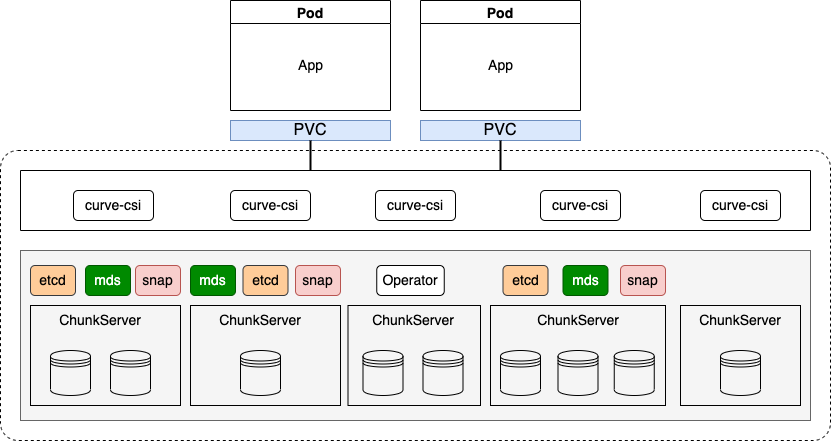

# Curve-Operator

## What's curve-operator

The curve-operator project helps deploy a Curve cluster orchestrated by Kubernetes.(Currently only supports CurveBS cluster deployment)



## Prerequisite

* Kubernetes 1.19+
* Three-nodes cluster(stand-alone deployment is not supported at persent)

## Install and Deploy

### 1. Install Operator

The first step is to install the Curve Operator.

```shell
$ git clone https://github.com/opencurve/curve-operator.git
$ cd curve-operator
$ kubectl apply -f config/deploy/
```

verify the curve-operator is in the `Running` state in `curvebs` namespace.

```shell
$ kubectl get pod -n curvebs

NAME                              READY   STATUS    RESTARTS   AGE
curve-operator-69bc69c75d-jfsjg   1/1     Running   0          7s
```

### 2. Deploy Curve cluster

#### Modify the cluster Declarative yaml file

```shell
$ vim config/samples/cluster.yaml
```

```yaml
apiVersion: operator.curve.io/v1
kind: CurveCluster
metadata:
  name: my-cluster
  # The namespace to deploy CurveBS cluster. 
  # Curve operator is deployed in this namespace,Do not modify if not necessary
  namespace: curvebs
spec:
  # The container image used to launch the Curve daemon pods(etcd, mds, chunkserver, snapshotclone).
  # v1.2 is Pacific and v1.3 is not tested.
  curveVersion:
    image: opencurvedocker/curvebs:v1.2
    # Container image pull policy, 
    # By default the pull policy of all containers in that pod will be set to IfNotPresent if it is not explicitly specified and no modification necessary.
    imagePullPolicy: IfNotPresent
  # The K8s cluster nodes name in cluster that prepare to deploy Curve daemon pods(etcd, mds, snapshotclone).
  # Three nodes must be configured here for a three-replica protocol, and don't support stand-alone deployment at present.
  # So, you must configure and only configure three nodes here. If it contain master plane node, that you must untaint it to allow scheduled.
  # - node1 -> etcd-a, mds-a, snapshotclone-a
  # - node2 -> etcd-b, mds-b, snapshotclone-b
  # - node3 -> etcd-c, mds-c, snapshotclone-c
  nodes:
  - curve-operator-node1
  - curve-operator-node2
  - curve-operator-node3
  # dataDirHostPath where data files and log files will be persisted on host machine. Must be specified.
  # If you reinstall the cluster, make surce that you delete this directory from each host.
  dataDirHostPath: /curvebs
  etcd:
    # Port for listening to partner communication. 
    # Etcd member accept incoming requests from its peers on a specific scheme://IP:port combination and the IP is host ip because we use hostnetwork:true.
    peerPort: 23800
    # clientPort for listening server port.
    clientPort: 23790
  mds:
    port: 26700
    dummyPort: 27700
  storage:
    # useSelectedNodes is to control whether to use individual nodes and their configured devices can be specified as well.
    # This field is not implemented at present and is must set false here.
    # You can refer following selectoedNodes setting commented if the function is completed later.
    useSelectedNodes: false
    # The hosts specified to deployment chunkserver as storage resource.
    # And you can configure the same nodes above configure that deploy etcd, mds and snapshotclone service.
    nodes:
    - curve-operator-node1
    - curve-operator-node2
    - curve-operator-node3
    port: 8200
    copysets: 100
    # Make sure the devices configured are available on hosts above.
    devices:
    - name: /dev/vdc
      mountPath: /data/chunkserver0
      percentage: 80
    #selectedNodes:
    #- node: curve-operator-node1
    #  - devices:
    #    name: /dev/vdd
    #    mountPath: /data/chunkserver1
    #    percentage: 90
    #  - devices:
    #    name: /dev/vdf
    #    mountPath: /data/chunkserver2
    #    percentage: 80
    #- node: curve-operator-node2
    #  - devices:
    #    name: 
    #    mountPath: 
    #    percentage: 
  snapShotClone:
    # set false if there is no S3 service available temporarily or don't need to use the snapshot clone service
    # Make sure s3 service exist if enable is set true
    enable: false
    port: 5555
    dummyPort: 8081
    proxyPort: 8080
    s3Config:
      # Access Key for the S3 service. Uploading snapshots
      ak: <>
      # Access Key for the S3 service. Uploading snapshots
      sk: <>
      # S3 service address
      nosAddress: <>
      # S3 service bucket name to store snapshots
      bucketName: <>
```

#### Deploy cluster

The specific meaning of each configuration item is already in the comments above `cluster.yaml`, which can be modified according to the instructions. Then you can deploy it in cluster.

Create the cluster:

```shell
$ kubectl apply -f config/samples
```

using `kubectl` to list pods in the curvebs namespace. You should be able to see the following pods once they are all running. The chunkserver numbers of will depend on the number of nodes in the cluster and the the number of devices configured. 

```shell
$ kubectl -n curvebs get pod

NAME                                                          READY   STATUS      RESTARTS   AGE
curve-chunkserver-curve-operator-node1-vdc-556fc99467-5nx9q   1/1     Running     0          5m45s
curve-chunkserver-curve-operator-node2-vdc-7cf89768f9-hmcrs   1/1     Running     0          5m45s
curve-chunkserver-curve-operator-node3-vdc-f77dd85dc-z5bws    1/1     Running     0          5m45s
curve-etcd-a-d5bbfb755-lzgrm                                  1/1     Running     0          41m
curve-etcd-b-66c5b54f75-6nnnt                                 1/1     Running     0          41m
curve-etcd-c-86b7964f87-cj8zk                                 1/1     Running     0          41m
curve-mds-a-7b5989bddd-ln2sm                                  1/1     Running     0          40m
curve-mds-b-56d8f58645-gv6pd                                  1/1     Running     0          40m
curve-mds-c-997c7fd-vt5hw                                     1/1     Running     0          40m
gen-logical-pool-rzhlz                                        0/1     Completed   0          5m15s
gen-physical-pool-chnw8                                       0/1     Completed   0          5m45s
prepare-chunkfile-curve-operator-node1-vdc-znb66              0/1     Completed   0          40m
prepare-chunkfile-curve-operator-node2-vdc-6gf2z              0/1     Completed   0          40m
prepare-chunkfile-curve-operator-node3-vdc-2bkxm              0/1     Completed   0          40m
read-config-k272k                                             0/1     Completed   0          41m
```

> Tips: The chunkserver pods may not start immediately, because the disk needs to be formatted in the background(`prepare-chunkfile` jobs), so it may take a while to see the chunkserver pod. The waiting time is determined according to the number and percentage of configured disks, and it may be a long time.

To verify that the cluster is in healthy state, enter one curve-chunkserver pod and `curve_ops_tools status` command to check.

```shell
$ kubectl exec -it <any one chunkserver pod> -- bash
$ cd /curvebs/tools/sbin
$ ./curve_ops_tool status

Cluster status:
cluster is healthy
total copysets: 100, unhealthy copysets: 0, unhealthy_ratio: 0%
physical pool number: 1, logical pool number: 1
Space info:
physical: total = 1178GB, used = 6GB(0.56%), left = 1171GB(99.44%)
logical: total = 392GB, used = 41GB(10.44%, can be recycled = 0GB(0.00%)), left = 351GB(89.56%), created file size = 60GB(15.28%)

Client status:
nebd-server: version-1.2.5+2c4861ca: 1
...
```

The cluster is deploymented completed and successfully if you see `cluster is healthy` prompt.

### 3. Use Curve CSI

After installing the operator and curve cluster, you can create a PVC that to use curvebs as pod storage.

Refer to the documentation [deploy curve-csi](https://ask.opencurve.io/t/topic/89) to deploy curve-csi and use curve as backend storage of pod.

More details can see `curve-csi` project at [curve-csi github](https://github.com/opencurve/curve-csi).

## Uninstall curve cluster

You can uninstall curve cluster deployed and clean up data on host.

### 1. Delete the `Curvecluster` CR:

```shell
$ kubectl -n curvebs delete curvecluster my-cluster
```

Verify that the cluster CR has been deleted before continuing to the next step.

```shell
$ kubectl -n curvebs get curvecluster
```

### 2. Delete the Operator and related Resources

This will begin the process of the curve-operator and all other resources being cleaned up.

```shell
$ kubectl delete -f config/deploy/
```

### 3. Delete data and log on host

The final cleanup setp requires deleting files on each host in the cluster. All files under the `dataDirHostPath` and `logDirHostPath` property specified in the cluster CRD will need to be deleted. Otherwise, inconsistent state will remain when a new cluster is started.

Connect to each machine and delete `/curvebs`, or the path specified by the `dataDirHostPath` and `logDirHostPath`.

```shell
$ rm -rf /curvebs
```

In the future this setp will not neccssary that we can delete it by running job on cluster if `cleanUpConfirm` is set.
