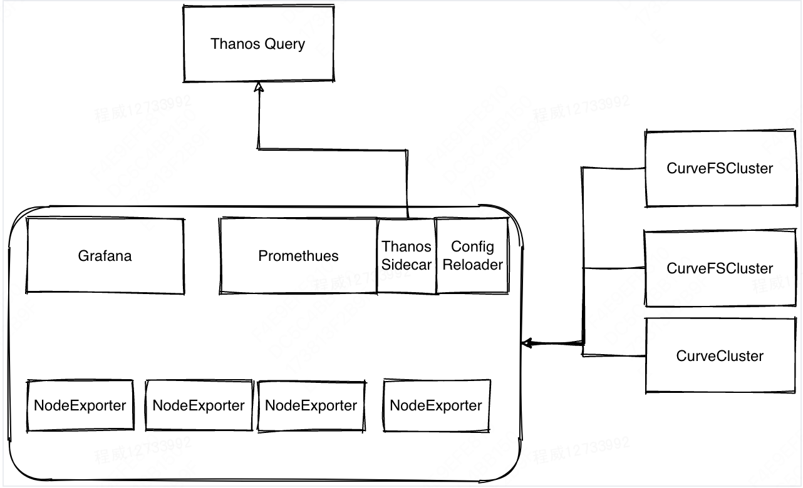

# 背景
当前CurveBS和CurveFS监控功能通过各自CRD中`monitor.enable`字段控制开关。
这种方式监控和集群一对一绑定，不支持多集群集中监控的场景。

# 现状
当前问题总结如下:
- 监控不支持多集群。
- 不支持监控相关WorkLoad配置更新
- WorkLoad应该采用Sts代替Deployment.
- 一些高级功能不支持，如Prometheus配置动态更新，Thanos 生态集成等。

# 方案设计


CRD Yaml 示例:
```
apiVersion: operator.curve.io/v1
kind: CurveMonitor
metadata:
  name: test
  namespace: curve
spec:
  replicas: 1
  clusters:
  - name: basic
    type: curvefs
  - name: basic2
    type: curvebs  
  prometheus:
    baseImage: prom/prometheus
    version: v2.27.1
  grafana:
    baseImage: grafana/grafana
    version: 7.5.11
  prometheusReloader:
    baseImage: quay.io/prometheus-operator/prometheus-config-reloader
    version: v0.49.0
  imagePullPolicy: IfNotPresent
```

