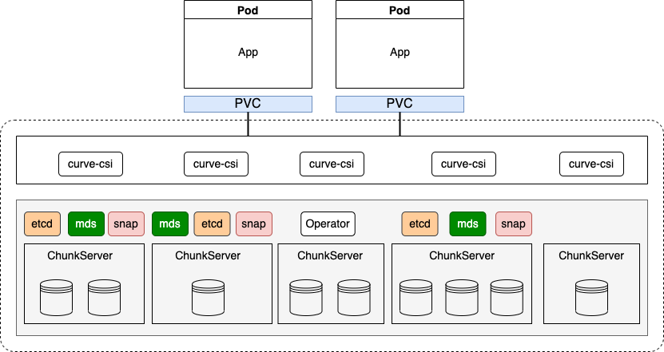

# CurveBS云原生部署方案

## 背景

当前，Curve还是主要以Docker容器的方式部署在物理机上运行，需要CurveAdm进行部署和管理。为了进一步地云原生化，需要考虑将Curve集群部署在Kubernetes等容器编排系统上，实现对Curve集群的自动部署以及自动运维能力，同时提高交付效率和交付水平。

## 目标

### 第一阶段：实现Curvebs集群部署与清除

#### 1. curvebs集群部署流程

0. 磁盘格式化与创建chunkfilepool
1. 启动etcd server
2. 启动mds server
3. 创建物理池
4. 启动chunkserver
5. 创建逻辑池
6. 启动snapshot server

#### 2. curvebs集群清除流程

1. 删除宿主机上的所有服务对应的日志文件和数据文件；
2. 清除所有重写配置文件的脚本文件；
3. 停止并删除容器服务；
4. 删除集群对象。

### Roadmap

| 特性               | 属性（优先级）   | 具体描述                                                     |
| ------------------ | ---------------- | :----------------------------------------------------------- |
| 集群创建           | P0               | 对接K8s，通过K8s声明式API的能力，实现对Curve集群的部署。     |
| 集群删除           | P0               | 对接K8s，监测Curve集群删除事件，停止集群所有Curve服务，并删除指定集群。步骤大概是：删除所有文件或目录，停止所有的services Container以及对应的Pod。 |
| 集群更新           | P1               | 根据集群声明修改，实现对集群细节的更新。比如添加/删除ChunkServer服务。对于添加和删除操作只需要启动或者停止对应的服务Container，删除操作要删除所有的宿主机文件。 |
| 监控系统           | P1               | 包括Prometheus和Grafana的部署，实现集群的可视化监控系统。方案可以考虑使用kube-prometheus直接部署。 |
| 版本升级           | P1               | 通过修改集群声明文件中的版本信息，实现Curve集群在K8s上的自动版本升级。参考CurveAdm的升级方式，滚动升级所有的服务。 |
| 服务迁移           | P2               | 修改集群声明文件，实现集群中服务的迁移。服务迁移需要在集群中手动添加机器，并修改集群声明文件。 |
| 集群扩缩容         | P2               | 支持一键扩缩容集群，同样是基于声明式设置修改。前提是用户添加机器至集群中，然后修改Storage部分添加对应的节点和硬盘，对添加的硬盘启动chunkserver服务。 |
| 磁盘发现           | P2               | 当前ChunkServer依靠手动配置，后续可以根据加入集群的节点中的所有磁盘自动确定。这一条参考rook-ceph的实现，简单的说就是扫描集群中的所有机器和硬盘，过滤出符合用户配置的硬盘加入集群。 |
| 多集群管理         | P2               | 根据创建不同的CR可以实现对多个集群的管理能力。同样，针对Curvefs的部署，可以定义CurvefsCluster该类CR进行构建。 |
| 自动故障诊断与恢复 | 待定（难度较大） | 比如监测磁盘故障并进行坏盘处理。可以实现，但是可能仍然避免不了手工干预。 |

## 架构



对于三副本，选择三个节点，部署etcd、mds和snapshotclone，使用DaemonSet进行部署。

Operator负责注册CurveCluster controller，controller对cluster事件进行监听，使用Deployment控制。

ChunkServer使用Deployment部署。

ConfigMap管理所有的配置文件。

## 设计细节

CurveCluster CR API对象数据结构如下：

```go
// CurveCluster is curve cluster representation
type CurveCluster struct {
  metav1.TypeMeta   `json:",inline"`
  metav1.ObjectMeta `json:"metadata"`
  Spec              ClusterSpec `json:"spec"`
  Status ClusterStatus `json:"status,omitempty"`
}

// ClusterSpec represents the specification of Curve Cluster
type ClusterSpec struct {
  // The version information of curve cluster
  CurveVersion CurveVersionSpec `json:"curveVersion, omitempty"`
  
  // The IP of nodes that to deploy etcd and mds roles
  Nodes []string `json:"nodes,omitempty"`
  
  // The path on the host where data stored for etcd and mds roles
  DataDirHostPath string `json:"dataDirHostPath, omitempty"`
  
  // The path on the host where logs stored for etcd role and mds roles
  LogDirHostPath string `json:"logDirHostPath, omitempty"`
  
  // A spec for etcd related options
  Etcd EtcdSpec `json:"etcd, omitempty"`
  
  // A spec for mds related options
  Mds MdsSpec `json:"mds, omitempty"`
  
  // A spec for available storage in the cluster and how it should be used
  Storage StorageScopeSpec `json:"storage,omitempty"`
  
  // A spec for snapShotCloneServer related options 
  SnapShot SnapShotSpec `json:"snapShot, omitempty"`
}
```

在CurveCluster中定义了对Curve集群的全局配置，比如DataDirHostPath和LogDirHostPath。同时，在各个组件的Spec字段中指定详细的参数。

* Nodes：这里固定要部署的节点，对于三副本，这里需要知道三个节点的IP（会在这三个节点上以DaemonSet形式部署etcd、mds以及snapshotclone），同时要为这三个节点都预打上label。

  ```shell
  kubectl label node <node-name> curve-role=etcd
  kubectl label node <node-name> curve-role=mds
  kubectl label node <node-name> curve-role=snapshot
  ```

* CurveVersionSpec：定义Daemon进程所使用的镜像版本以及镜像拉取策略；

* DataDirHostPath：定义各个组件在宿主机上的持久化数据目录，通过hostpath进行映射容器内/curvebs/[role]/data；

* LogDirHostPath：定义各个组件在宿主机上的持久化日志目录，通过hostpath进行映射容器内/curvebs/[role]/logs；

* MdsSpec：mds server配置，定义端口以及其他可配置参数；

* EtcdSpec：etcd server配置，定义端口以及其他可配置参数；

* SnapShotServerSpec：snapShotClone Server配置，定义是否启动、S3桶配置以及其他参数；

* StorageScopeSpec：对于可获得的storage资源配置(chunkserver)。包括是否使用所有的节点搭建集群，或者可以配置只用几个节点进行搭建。以及是否使用集群中的所有设备，或者是配置对磁盘的过滤条件，或者是每一个节点的可以配置的对磁盘的过滤条件。（通常只要保证可配置节点，并且可以配置对这些节点的设备过滤条件，如下是一个可能的配置情况。）

  ```yaml
  storage: # cluster level storage configuration and selection
      # if 'useAllNodes' is set to true, K8s will list all nodes in cluster and used as chunkserver.
      # if set to false, then will use 'nodes' spec setting
      useAllNodes: false
      nodes:
        - server_host1
        - server_host2
        - server_host3
      devices:
        - name: "/dev/sda"
          mountPath: "/data/chunkserver0"
          percentage: 90
  # Individual nodes and their config can be specified as selectedNodes once the selectedNodes object is not nil, but 'useAllNodes' above must be set to false.
      # selectedNodes:
      #   - name: "10.219.196.100"
      #     devices: # specific devices to use for storage can be specified for each node
      #       - name: "sdb"
      #         mountPath: /data/chunkserver0
      #         percentage: 90
      #       - name: "sdc"
      #         mountPath: /data/chunkserver1
      #         percentage: 90
      #   - name: "10.219.196.101"
      #     devices: # specific devices to use for storage can be specified for each node
      #       - name: "sdb"
      #         mountPath: /data/chunkserver0
      #         percentage: 80
      #       - name: "sdc"
      #         mountPath: /data/chunkserver1
      #         percentage: 90
  ```

### Etcd server

etcd server使用DaemonSet进行部署，可以保证所有的节点只会部署一份，同时使用nodeSelector将Pod调度到用户预先指定的节点上，其余节点不会调度。这样就能保证label的节点上都已经被调度，且每个节点只会运行一个etcd pod。

在部署etcd集群的时候，需要知道所有成员的IP地址或者是域名格式，现在因为mds必须知道etcd endpoint的IP，所以并不能使用StatefulSet去做（没有IP）,目前比较简单的方法就是直接固定机器（预先知道要部署的机器的IP地址，并且对这些节点打上label）

因为所有的服务在集群中是不可变的，要求IP和端口固定，所以设置hostnetwork: true使用宿主机地址，后面mds直接用这些宿主机地址即可。

EtcdSpec定义对etcd server的配置：

```go
// EtcdSpec represents the specification of the etcd
type EtcdSpec struct {
  // Port 
  // +optional
  Port int `json:"port,omitempty"`
  // LisentPort
  // +optional
  ListenPort int `json:"listenPort,omitempty"`
  // Config other startup parameters if need
  // +optional
  Config map[string]string `json:"config,omitempty"`
}
```

用户对于etcd的具体配置选项可以通过设置Config字段进行修改，比如Debug: false，这些修改通过Init Container中进行替换配置文件中的默认值。最后启动指定数量的etcd server。

> 上述的端口也可以直接固定，不支持定义修改。

**修改启动配置文件的方法：**

方案1：

在本地编写处理脚本，创建对应文件的ConfigMap并将其添加到一个卷中，在Init container中挂载该卷到指定的目录下，执行该脚本修改配置文件并且将修改后的配置文件拷贝至一个临时卷（script-volume）中。最后在主容器中挂载该卷，从而可以使用修改后的文件进行启动。

方案2：

镜像与配置分离，将配置模板文件解析并预先创建default ConfigMap，然后在程序中根据解析的参数覆盖ConfigMap对应的值，将该ConfigMap添加到一个卷中（config-volume），在主容器中挂载该卷，最后使用该配置文件启动etcd服务即可。

### Mds Server

Mds server的部署和Etcd的部署方式一致。需要在MdsSpec中配置对Mds的配置参数，下面是可能的配置参数。

Mds server使用DaemonSet进行部署，用户需要预先打标签的方式将其调度到指定的节点上，同时可以保证Pod部署在不同的节点上。同样为了保证Pod IP地址不变的话，设置hostnetwork使用宿主机的地址。Port和DummyPort默认固定设置即可。

```go
// MdsSpec represents the specification of the mds
type MdsSpec struct {
  // Port 
  // +optional
  Port int `json:"port,omitempty"`
  // DummyPort
  // +optional
  DummyPort int `json:"dummyPort,omitempty"`
  // Config other startup parameters if need
  // +optional
  Config map[string]string `json:"config,omitempty"`
}
```

#### 修改启动配置

Mds的启动依赖于mds.conf配置文件，在该conf文件中，有几个IP字段需要确定：

1. mds.listen.addr：Pod本身的IP以及监听端口，端口固定，IP地址为宿主机地址也可以确定，并且不会发生变化；
2. mds.etcd.endpoint：etcd endpoint集群的地址，etcd也是配置使用的hostnetwork网络，IP不会变化，可以确定；
3. 其他相关配置：额外的配置参数通过Config字段自定义进行设置修改。

需要在Mds Pod创建之前确定所有参数，修改配置文件的方法和修改etcd参数的方法一样，可以选择上述两种方法实现。

### ChunkServer

ChunkServer的配置是通过StorageScopeSpec进行设置。

```go
type StorageScopeSpec struct {
  // +optional
  UseAllNodes bool `json:"useAllNodes,omitempty"`
  // Nodes specify the node that to use storage
  Nodes []string `json:"nodes,omitempty"`
  // +optional
  Devices []Device `json:"devices,omitempty"`
  // +optional
  SelectedNodes []SelectedNodesSpec `json:"selectedNodesSpec",omitempty`
}
```

* UseAllNodes：表示是否使用集群中的所有节点，true则表示使用所有Ready状态的节点，false则表示使用Nodes指定的节点；
* Nodes：当UseAllNodes：false时，则会使用这里指定的节点；
* Device：表示Disk信息，包括Name、MountPath以及Percentage，如下所示。

```go
// Device represents a disk to use in the cluster
type Device struct {
  // +optional
  Name string `json:"name,omitempty"`
  // +optional
  MountPath string `json:"fullpath,omitempty"`
  // +optional
  Percentage int `json:"config,omitempty"`
}
```

* SelectedNodes：更灵活的选择nodes以及devices的方式，使用该字段必须将UseAllNodes设置为false。

```go
type SelectedNodes struct {
  // +optional
  Name string `json:"name,omitempty"`
  // +optional
  Devices []Device `json:"devices,omitempty"`
}
```

#### 1. Job进行磁盘格式化和挂载

根据用户配置，开启Job进行磁盘格式化任务，步骤包括1. Mkfs 2. Mount device ~~3. Edit fstab~~，上述这些步骤都可以在init contianer进行，并且保证顺序操作。

Pod中操作宿主机环境，需要设置Pod/Container的security context[（k8s security-context）](https://kubernetes.io/docs/tasks/configure-pod-container/security-context/)，这样就无需额外的手动操作进行上面的步骤。下面是Pod可能的安全配置：

```yaml
securityContext:
  # 运行在特权模式
  privileged: true
  readOnlyRootFilesystem: false
  runAsNonRoot: false
  runAsUser: 0
```

#### 2. 预分配chunkfilepool

Job的init container负责磁盘格式化与挂载，主容器执行curve_format预分配chunkfilepool，主容器会等待curve_format任务结束后自行退出。需要指定预分配的node，device以及percentage。在创建之后需要等待执行完毕，Job的结束状态可知（.status.completionTime是否为nil）。

具体的操作如下列命令：

```shell
curve_format -filePoolDir=/... -filePoolMetaPath=/.. -fileSystemPath= /.. -allocateByPercent=true -allocatePercent=90 
```

上述步骤**1**和**2**都需要将设置的mountPath挂载到Pod中，从而可以在Pod中对该宿主机目录进行操作。每一个有效的Ready节点都会创建一个Job。

#### 3. 创建physical pool和logical pool

按照CurveAdm的做法，生成对应topology.yaml的topology.json，然后使用curvebs_tool进行注册，创建对应的physical pool和logic pool，而在K8s处理过程中这里的topology文件内容可以通过解析用户的Storage配置获取，具体逻辑参考adm。

注册pool使用curvebs-tool进行注册即可：

```shell
# 注册 physical pool
$ curbebs-tool -op=create_physicalpool -cluster_map=/curvebs/tools/conf/topology.json
# 注册 logical pool
$ curvebs-tool -op=create_logicalpool -cluster_map=/curvebs/tools/conf/topology.json
```

生成对应的json文件，将文件映射到本地，利用容器中的curvebs-tool工具使用该文件创建物理池，随后启动chunkServer。

#### 4. 启动ChunkServer Pod

对每一个node的每一块设备都会创建一个chunkserver Pod，使用Deployment控制器部署Pod。对所有的在部署之前获取已经部署的mds endpoints的IP：Port并写入启动参数配置文件进行覆盖，这个操作在Pod的init container中执行。 主容器使用该配置文件启动chunkserver daemon。

网络固定，使用hostnetwork。

```shell
/curvebs/chunkserver/sbin/curvebs-chunkserver -raftLogUri=curve:///curvebs/chunkserver/data/copysets  ...         -conf=/curvebs/chunkserver/conf/chunkserver.conf
```

### SnapShotClone

SnapShotClone的部署和Mds以及Etcd部署一样，除了设置对应的Port之外，还需要配置S3桶的相关参数。

```go
type SnapShotSpec struct {
  // Enable
  Enable bool `json:"enable,omitempty"`
  // Port 
  // +optional
  Port int `json:"port,omitempty"`
  // DummyPort
  // +optional
  DummyPort int `json:"dummyPort,omitempty"`
  // ProxyPort
  // +optional
  ProxyPort int `json:"proxyPort,omitempty"`
  // S3Config
  S3Config S3Config `json:"s3Config,omitempty"`
}
```

### CurveCluster Controller

CurveCluster Controller的主要作用是监视 CurveCluster 对象，根据该类型对象事件做出响应。对于当前部署工作，就是对新建的CurveCluster对象，在相应的节点启动Curve daemon进程，以各种控制器（Daemonset/Deployment）部署MDS、Etcd、SnapShotServer和ChunkServer pods，也就是上述的所有步骤。

### Operator

Curve operator主要是利用controller-runtime pkg创建manager，注册所有的controller并且启动manager，目前针对部署任务只有CurveCluster controller需要注册。

后续所有的Controller都会通过该过程进行注册并添加至manager进行管理，后续对于各种运维操作添加的controller，可以直接提供Add方法。

## 部署效果与使用方法

完成对三副本部署，包括Etcd/Mds/ChunkServer/SnapShotClone（isEnabled?），部署完成之后可能会有以下几个服务：

```shell
$ kubectl get pod -n curvebs
  curve-etcd-axxx
  curve-etcd-bxxx
  curve-etcd-cxxx
  curve-mds-axxx
  curve-mds-bxxx
  curve-mds-cxxx
  curve-chunkserver-a
  curve-chunkserver-b
  curve-chunkserver-c
  curve-chunkserver-d
  curve-chunkserver-e
  curve-snapshotclone-axxx
  curve-snapshotclone-bxxx
  curve-snapshotclone-cxxx
  curve-csi-controller-xxx
  curve-csi-node-axxx
  curve-csi-node-bxxx
  curve-csi-node-cxxx
```

### 1. 注册Storageclass

```yaml
allowVolumeExpansion: true
apiVersion: storage.k8s.io/v1
kind: StorageClass
metadata:
  name: curve
parameters:
  user: k8s
  cloneLazy: "true"
provisioner: curve.csi.netease.com
reclaimPolicy: Delete
volumeBindingMode: Immediate
```

### 2. PVC声明

```yaml
apiVersion: v1
kind: PersistentVolumeClaim
metadata:
  name: curve-pvc
spec:
  accessModes:
  - ReadWriteOnce
  resources:
    requests:
      storage: 20Gi
  storageClassName: curve
```

### 3. Pod使用上述PVC

```yaml
apiVersion: v1
kind: Pod
metadata:
  name: csi-curve-test
spec:
  containers:
  - name: web-server
    image: nginx
    volumeMounts:
    - name: mypvc
      mountPath: /var/lib/www/html
  volumes:
  - name: mypvc
    persistentVolumeClaim:
      claimName: curve-pvc
```

## 后续规划

1. 目前服务依赖于IP：Port形式，这种方式在K8s中使用不灵活，后续所有服务支持域名访问；
2. 监控接入可以考虑使用线上大规模使用的Kube-prometheus解决方案；
3. 为了保证集群的正常以及基础功能，集群监控、更新与版本升级是第二阶段的重点，后续外部开发者可以在已有框架基础上进行开发，难度可能也比较适中；需要提供具体的开发框架和实现步骤给外部开发者。
4. 对于集群的自动运维，包括故障发现与恢复，实现难度较大，需要综合考虑最终想要的效果与实现复杂度。
